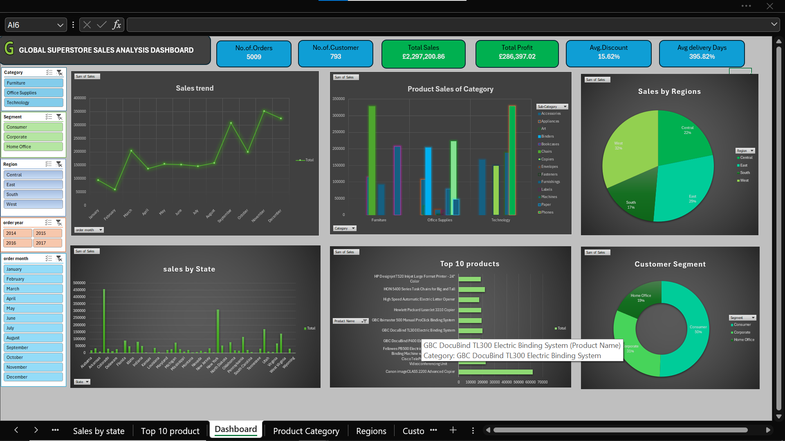

# 📊 Global Superstore Sales Analysis Dashboard

## 🚀 Project Overview
The Global Superstore Sales Dashboard is an interactive business intelligence project developed in Microsoft Excel to analyze sales performance, profitability, customer behavior, product trends, and regional performance.

This dashboard helps stakeholders and business users monitor KPIs, identify sales opportunities, track top-performing products, and make data-driven decisions through interactive visualizations and dynamic filtering.

---

# 🎯 Business Objectives
- Analyze overall sales and profit performance
- Monitor customer segments and regional contribution
- Identify top-performing products and categories
- Track monthly sales growth trends
- Compare state-wise sales distribution
- Improve business decision-making using visual analytics

---

# 🛠️ Tools & Technologies Used
| Tool | Purpose |
|------|----------|
| Microsoft Excel | Dashboard Development |
| Pivot Tables | Data Aggregation |
| Pivot Charts | Data Visualization |
| Slicers | Interactive Filtering |
| Conditional Formatting | KPI Highlighting |
| Data Cleaning | Data Preparation |

---

# 📌 Dashboard Features

## 📈 KPI Cards
The dashboard includes dynamic KPI indicators for:
- Total Orders
- Total Customers
- Total Sales
- Total Profit
- Average Discount
- Average Delivery Days

---

## 📊 Visualizations Included

### 1️⃣ Sales Trend Analysis
- Monthly sales performance tracking
- Identifies peak and low sales periods
- Helps understand seasonal trends

### 2️⃣ Product Sales by Category
- Comparison across Furniture, Office Supplies, and Technology
- Category-wise product performance insights

### 3️⃣ Regional Sales Distribution
- Interactive pie chart showing sales contribution by region
- Easy comparison of regional performance

### 4️⃣ State-wise Sales Analysis
- Displays top-performing states
- Helps identify high-revenue locations

### 5️⃣ Top 10 Products
- Highlights best-selling products
- Supports inventory and sales strategy planning

### 6️⃣ Customer Segment Analysis
- Consumer vs Corporate vs Home Office comparison
- Understands customer contribution to revenue

---

# 🎛️ Interactive Filters
Users can dynamically filter dashboard data using slicers:
- Category
- Segment
- Region
- Order Year
- Order Month

This improves user experience and enables drill-down analysis.

---

# 📷 Dashboard Preview

---

# 📂 Project Files
- 📄 Global Superstore Dashboard.xlsx
- 🖼️ Superstore Dashboard.png
- 📘 README.md

---

# 🔍 Key Business Insights
- Technology category generated the highest sales
- West region contributed maximum revenue share
- Consumer segment showed the highest customer contribution
- Certain states significantly outperformed others in sales
- Monthly sales trends indicate strong Q4 performance

---

# 💡 Skills Demonstrated
- Data Analysis
- Business Intelligence
- Dashboard Designing
- Excel Automation
- Data Visualization
- KPI Reporting
- Interactive Reporting
- Analytical Thinking

---

# 📚 Learning Outcome
Through this project, I improved my understanding of:
- Excel Dashboard Development
- Business KPI Tracking
- Data Storytelling
- Interactive Reporting Techniques
- Sales Performance Analysis

---

# 👨‍💻 Author
ABDUSSAMI SAYYED

📧 Email: abdussamisayyed@gmail.com  
🔗 GitHub: https://github.com/abdussamisayyed-analyst

---

# ⭐ If you found this project useful, give it a star on GitHub!
